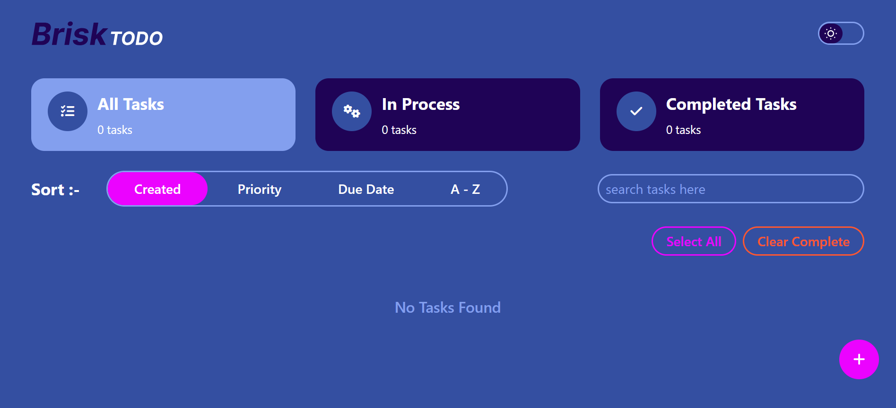
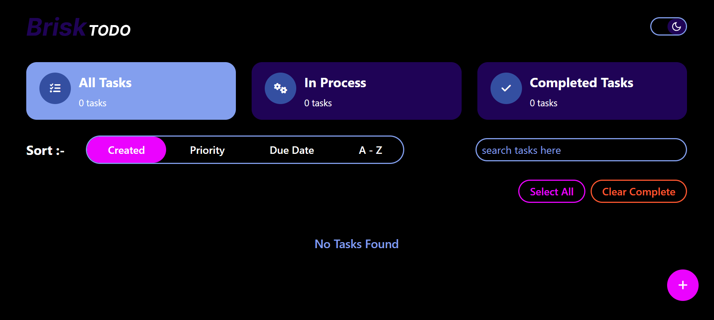
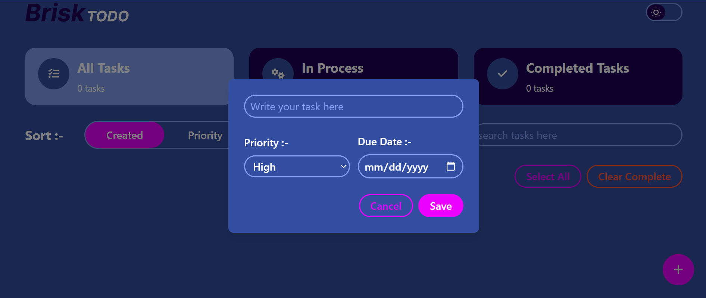
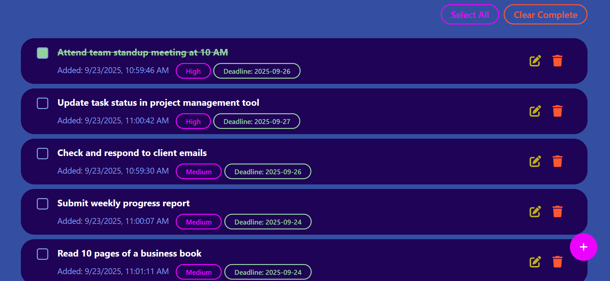

# 📝 Advanced Todo App

A fully-functional **Todo app** developed with HTML, Tailwind CSS, and vanilla JavaScript. Includes features such as task filtering, searching, sorting, and persistent storage via localStorage.

---

## 🔗 Live Demo

👉 [View Project on GitHub Pages](#)

---

## 🚀 Features

- ✅ Add, edit, delete tasks
- ✅ Mark tasks as completed (with strike-through effect)
- ✅ Save tasks in **LocalStorage** (persists after refresh)
- ✅ Filter tasks (All, Active, Completed) with live counts
- ✅ Search tasks with **debounce functionality**
- ✅ Sort tasks by:
  - Created Date
  - Priority (High, Medium, Low)
  - Due Date
  - A–Z Title
- ✅ Select All / Clear Completed actions
- ✅ Responsive UI with smooth transitions
- 🌙 Dark/Light mode toggle (with saved user preference)

---

## 🛠️ Technologies Used

- **HTML5**
- **Tailwind CSS**
- **Vanilla JavaScript (ES6+)**
- **LocalStorage**

---

## 📸 Screenshots

### 🏠 Homepage

### ➕ Add Task Modal

### 📋 Task List

---

## 👨‍💻 Author

**Farhana Tammy**  
💼 [LinkedIn](https://www.linkedin.com/in/farhana-islam-khan-6b6405290/)

---